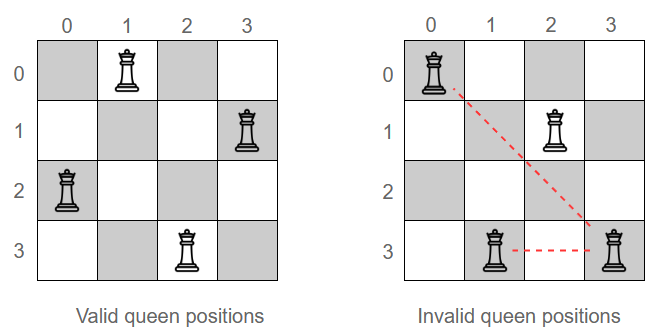

# Artificial Intelligence 2022/2023 - N Queens Problem
## Author: Rosario Scavo

This project is part of the Artificial Intelligence course for the academic year 2022/2023. It explores various methods to solve the N-Queens problem, including Random Search, Backtracking, Hill-Climbing, Simulated Annealing, and Genetic Algorithms. Each method is evaluated for its efficiency and effectiveness in finding solutions.

## Problem Description
The **N-Queens problem** is a classic puzzle in which the challenge is to place *N* queens on an *N x N* chessboard in such a way that no two queens threaten each other. This means that no two queens can be placed in the same row, column, or diagonal. The significance of this problem in **Artificial Intelligence (AI)** lies in its use as a benchmark for evaluating algorithms, particularly those involving **backtracking** and **search strategies**.

## Summary of Results

The N-Queens problem was approached using various methods, each with different levels of success and efficiency:

- **Random Search**: Struggles with even small search spaces (N = 8) with a 40% success rate.
- **Backtracking**: Performs well in smaller spaces (N = 24) with a 100% success rate, but fails in larger spaces (N = 32).
- **Standard Hill Climbing**: Fails to solve even N = 8 due to local optima.
- **Hill Climbing with Sideways Moves**: Can solve larger problems (N = 60) but takes longer (55 seconds).
- **Stochastic Hill Climbing with Sideways Moves**: Improves results up to N = 60.
- **Simulated Annealing**: Most efficient, solving N = 60 in 10 seconds and N = 100 in 50 seconds, demonstrating scalability.
- **Genetic Algorithms**: Least efficient, struggling with N = 8 even with hyperparameter tuning.

These results highlight the efficiency and scalability of Simulated Annealing for larger instances of the N-Queens problem.

## Table of Contents
- Problem Description
- Board
  - Board Generation
    - One per Column
    - One per Row
  - Board Visualization
- Count the Number of Conflicts
  - $O(n^2)$ Solution
  - $O(n)$ Solution
  - Speed Comparison
- Methods
  - Random Search
  - Backtracking
  - Hill-Climbing
    - Hill-Climbing without Sideways Moves
    - Stochastic Hill-Climbing with Sideways Moves
    - Random-Restart Hill-Climbing
  - Simulated Annealing
  - Genetic Algorithms
    - Hyperparameter Tuning
- Conclusion

---

For detailed information, please refer to the `N-Queens.ipynb` file.
